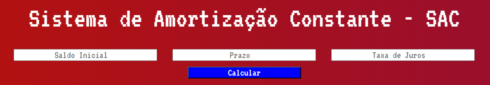
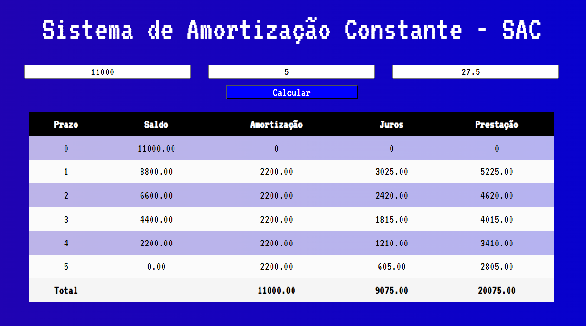

# Sistema-De-Amortização-Constante
<h2>Sobre o Projeto</h2>

 O projeto foi desenvolvido para auxiliar nos cálculos referentes a finanças, especificamente aos sistemas de amortização constante, ou SAC 

<h2> Descrição do Projeto </h2>

 O sistema em si é simples, na pagina "index.html" temos 3 campos para serem preenchidos:
<ul>
<li> O Saldo Inicial;
<li> O prazo (em meses);
<li> E a taxa de Juros;  
</li>
</ul>
  
  Quando clicamos em "Calcular", ele gera uma tabela dinamica, feita em Javascript
  
  

<h3> Status do Projeto </h3>

 🕓 Em Atualização, em breve será postado o Sistema de Amortização Francês e o Price 

<h3> Linguagens e Ferramentas utilizadas </h3>
  <a href="https://devdocs.io/css/"> 

